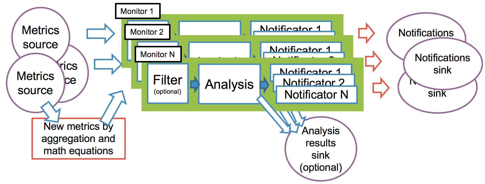

# ExDeMon: extract, define and monitor metrics

A general purpose metric monitor implemented with Apache Spark. [](https://gitlab.cern.ch/TapeAnalytics/ExDeMon/commits/master)

Metrics can come from several sources like Kafka, results and actions can be sunk to Elastic or any other system, new metrics can be defined combining other metrics, different analysis can be applied, notifications, configuration can be updated without restarting, it can detect missing metrics, ...

This tool was introduced at Spark Summit 2017 conference, you can watch the talk [here](https://www.youtube.com/watch?v=1IsMMmug5q0&feature=youtu.be&t=11m17s).

[User's manual](./doc/users-manual/users-manual.md)

An example of a monitored metric can be observed in the following image. As it can be observed, thresholds around the value are calculated and statuses are generated if analyzed value exceed these limits. 
Action can be triggered if certain statuses like error or warning are maintained during some time.    


### Key features

- Stand-alone or distributed (scalable) execution, all possible platforms that Spark is compatible with.
- Metrics value can be float, string or boolean.
- New metrics can be defined. Mathematical operations can be applied. Value of new metrics can be computed by aggregating different incoming metrics. 
- Several monitors can be declared, each monitor can have a metric filter, a metric analysis and triggers. 
- Several metric sources can be declared. Incoming data can have different schemas that can be configured to produce metrics.
- One analysis result sink is shared by all monitors.
- Several actuators, to be able to perform different actions.
- Components: properties source, metrics source, analysis, analysis results sink, trigger and actuators. They can be easily replaced. 
- Some built-in components: Kafka source, different analysis, Elastic sink, e-mail, ...
- Metrics can arrive at different frequencies.
- Configuration can be updated while running. Configuration comes from an external source (Apache Zookeeper, HTTP request, data base, files, ...).
- Detection of missing metrics.

An image that describes some of the previous concepts and shows the data flow in the streaming job can be seen here.  


## Define new metrics

The value of these defined metrics is computed from an equation. 

This equation can have variables, these variables represent incoming metrics. So, values from several metrics can be aggregated in order to compute the value for the new metric.

Metrics can be grouped by (e.g. cluster) in order to apply the equation to a set of metrics.

Some possibilities of defined metrics could be:
- Multiply all metrics by 10: value * 100
- Compute the ratio read/write for all machines: (groupby: hostname) readbytes / writebytes
- Temperature inside minus temperature outside: tempinside - tempoutside
- Average of CPU usage of all machines per cluster
- Total throughput of machines per cluster in production 
- Count log lines of the previous hour 
- Threshold for /tmp/ directory usage.
```
<defined-metric-id>.value = !shouldBeMonitored || (trim(dir) == "/tmp/") && (abs(used / capacity) > 0.8)
```

Easy debugging, you would get:
```
# With errors
!(var(shouldBeMonitored)=true)=false || ((trim(var(dir)=" /tmp/  ")="/tmp/" == "/tmp/")=true && (abs((var(used)=900.0 / var(capacity)={Error: no value for the last 10 minutes})={Error: in arguments})={Error: in arguments} > 0.8)={Error: in arguments})={Error: in arguments})={Error: in arguments}

# With successful computation
!(var(shouldBeMonitored)=true)=false || ((trim(var(dir)=" /tmp/  ")="/tmp/" == "/tmp/")=true && (abs((var(used)=900.0 / var(capacity)=1000.0)=0.9)=0.9 > 0.8)=true)=true)=true
```

## Monitors

Metrics are consumed by several sources and sent to all monitors.

Many monitors can be declared. Each monitor has a filter to determine to which metrics it should be applied.
Filtered metrics are analyzed to determine the current status of the metric.
Several triggers can be configured to raise actions.

Results from analysis can be sunk to external storages and actions are processed by actuators.

## Components

They are considered parts of the processing pipeline that can be easily replaced by other built-in components or by an externally developed component.

If you are willing to develop any component, look at the [developers guide](./doc/developers-guide.md).

### Properties source

This component is meant to consume configuration properties from an external source.

This source is periodically queried and the job will be updated with new configuration.

### Metric source

This component is meant to consume metrics from a source and generate an stream of metrics. 

Several sources can be declared for the job. All monitors consume from all sources.

Consumed metrics could come with different schemas. Each schema can be declared to parse metrics.

Built-in metric sources:
- Kafka.

### Metric analysis

This component is meant to determine the status (error, warning, exception, ok) of each of the incoming metrics.

Each monitor configures its own analysis.

Built-in metric analysis:
- Fixed threshold: error and warning thresholds.
- Recent activity: error and warning thresholds are computed using average and variance from recent activity.
- Percentile: error and warning thresholds are computed based on percentiles from recent activity.
- Seasonal: a season is configured (hour, day or week), using a learning coefficient, average and variance are computed along the season, these two values are used to calculate error and warning thresholds.  

### Analysis results sink

Analysis produce results for each of the incoming metrics. These results can be sunk to an external storage for watching the metric and analysis results.

Only one analysis results sink is declared for the job. All monitors use this sink.

Built-in analysis results sink:
- Elastic.
- HTTP (POST).

### Trigger

A trigger determine when to raise an action based on analysis results.

Several triggers can be configured in a monitor.

Built-in triggers:
- Statuses: raise an action as soon as it receives a metric with one of the configured statuses.
- Constant status: if a metric has been in configured statuses during a certain period.
- Percentage status: if a metric has been in configured statuses during a percentage of a certain period.

### Actuators

Actions triggered by monitors are processed by one or several actuators. Actuators can save actions into an external storage, send e-mails, run jobs, etc.

Built-in actuators:
- Email.
- HTTP (e.g. to [Mattermost](https://api.mattermost.com/) or [Rundeck](http://rundeck.org/)).