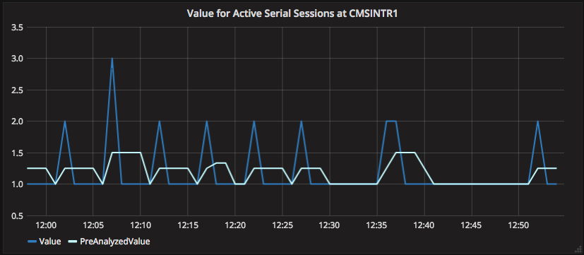
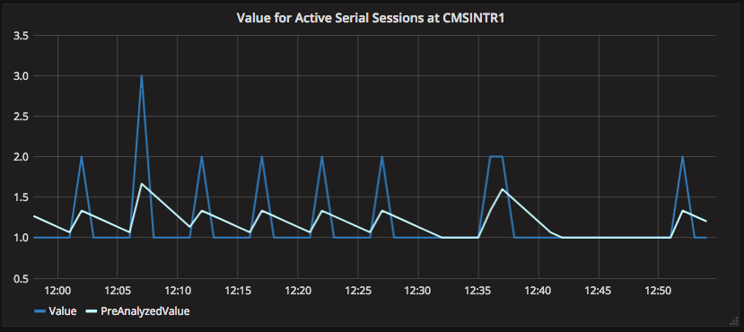

# Spark Streaming job for monitoring metrics: user manual

## Running the job

```
$SPARK_HOME/bin/spark-submit \
	--master yarn \
	--class ch.cern.spark.metrics.Driver \
	spark-metrics-*.jar \
	<path_to_conf_file>
```

## Configuration

A basic configuration contains a metric source, one or more monitors and analysis result or notifications sink.

Each monitor and notificator must have a different ID.

```
checkpoint.dir = <path_to_store_stateful_data> (default: /tmp/)
spark.batch.time = <period like 1h, 3m or 45s> (default: 1m)

# Data for metrics that are not coming will expire 
data.expiration = <period like 1h, 3m or 45s> (default: 30m)

# Optional
properties.source.type = <properties_source_type>
properties.source.<other_confs> = <value>

# At least one source is mandatory
metrics.source.<metric-source-id-1>.type = <metric_source_type>
metrics.source.<metric-source-id-1>.<other_confs> = <value>
metrics.source.<metric-source-id-2>...
metrics.source.<metric-source-id-n>...

# Optional
metrics.define.<defined-metric-1>...
metrics.define.<defined-metric-2>...
metrics.define.<defined-metric-n>...

# At least one sink must be declared
results.sink.type = <analysis_results_sink_type>
results.sink.<other_confs> = <value>
notifications.sink.type = <notifications_sink_type>
notifications.sink.<other_confs> = <value>

# Monitors
monitor.<monitor-id-1>.<confs>...
monitor.<monitor-id-2>.<confs>...
monitor.<monitor-id-n>.<confs>...
```

An example of full configuration can be:

```
checkpoint.dir = /tmp/spark-metrics-job/

# Metric comes from a Kafka cluster
metrics.source.kafka-prod.type = kafka
metrics.source.kafka-prod.consumer.bootstrap.servers = habench101.cern.ch:9092,habench102.cern.ch:9092,habench103.cern.ch:9092
metrics.source.kafka-prod.consumer.group.id = spark_metric_analyzer
metrics.source.kafka-prod.topics = db-logging-platform
# These two parameters are extracted from metrics (they are enough to identify a metric)
metrics.source.kafka-prod.parser.attributes = INSTANCE_NAME METRIC_NAME
metrics.source.kafka-prod.parser.value.attribute = VALUE
metrics.source.kafka-prod.parser.timestamp.attribute = END_TIME

metrics.define.DBCPUUsagePercentage.value = DBCPUUsagePerSec / HostCPUUsagePerSec
metrics.define.DBCPUUsagePercentage.metrics.groupby = INSTANCE_NAME
metrics.define.DBCPUUsagePercentage.variables.DBCPUUsagePerSec.filter.attribute.METRIC_NAME = CPU Usage Per Sec
metrics.define.DBCPUUsagePercentage.variables.HostCPUUsagePerSec.filter.attribute.METRIC_NAME = Host CPU Usage Per 

metrics.define.cluster-total-read-bytes.metrics.groupby = CLUSTER_NAME
metrics.define.cluster-total-read-bytes.variables.readbytes.filter.attribute.METRIC_NAME = Read Bytes
metrics.define.cluster-total-read-bytes.variables.readbytes.aggregate = sum

# Analysis results are sinked to Elastic
results.sink.type = elastic
results.sink.index = itdb_db-metric-results/log

# Notifications are sinked to Elastic
notifications.sink.type = elastic
notifications.sink.index = itdb_db-metric-notifications/log

spark.es.nodes=es-itdb.cern.ch
spark.es.port=9203

# Monitor CPU of all instances
# attribute.INSTANCE_NAME does not need to be specified, same efect as .*
monitor.CPUUsage.filter.attribute.INSTANCE_NAME = .*
monitor.CPUUsage.filter.attribute.METRIC_NAME = CPU Usage Per Sec
monitor.CPUUsage.pre-analysis.type = weighted-average
monitor.CPUUsage.pre-analysis.period = 10m
monitor.CPUUsage.analysis.type = fixed-threshold
monitor.CPUUsage.analysis.error.upperbound = 800
monitor.CPUUsage.analysis.warn.upperbound  = 600
monitor.CPUUsage.analysis.error.lowerbound = -1
monitor.CPUUsage.tags.email = procurement-team@cern.ch
# This monitor does not produce notifications

# Monitor percentage of DB usage of all instances
monitor.DBCPU.filter.attribute.$defined_metric = DBCPUUsagePercentage
monitor.DBCPU.pre-analysis.type = weighted-average
monitor.DBCPU.pre-analysis.period = 10m
monitor.DBCPU.analysis.type = fixed-threshold
monitor.DBCPU.analysis.error.upperbound = 800DBCPU
monitor.DBCPU.analysis.warn.upperbound  = 600
monitor.DBCPU.analysis.error.lowerbound = -1
monitor.DBCPU.tags.email = databases-team@cern.ch
# This monitor does not produce notifications

# Monitor all metrics (no filter)
monitor.all-seasonal.pre-analysis.type = weighted-average
monitor.all-seasonal.pre-analysis.period = 3m
monitor.all-seasonal.analysis.type = seasonal
monitor.all-seasonal.analysis.season = hour
monitor.all-seasonal.analysis.learning.ratio = 0.2
monitor.all-seasonal.analysis.error.ratio = 6
monitor.all-seasonal.analysis.warn.ratio = 3
monitor.all-seasonal.notificator.error-constant.type = constant
monitor.all-seasonal.notificator.error-constant.statuses = ERROR
monitor.all-seasonal.notificator.error-constant.period = 10m
monitor.all-seasonal.notificator.warn-constant.type = constant
monitor.all-seasonal.notificator.warn-constant.statuses = WARNING
monitor.all-seasonal.notificator.warn-constant.period = 20m
```

## Define new metrics

```
metrics.define.<defined-metric-id>.value = <methematical equation containing <variable-ids>> (default: <variable-id> if only one variable has been declared)
metrics.define.<defined-metric-id>.when = <ANY|BATCH|comma separated list of variable-ids> (default: the first variable after sorting)
metrics.define.<defined-metric-id>.metrics.groupby = <not set/ALL/comma separated attribute names> (default: not set)
metrics.define.<defined-metric-id>.variables.<variable-id-1>.filter.attribute.<attribute-name-1> = <value-1>
metrics.define.<defined-metric-id>.variables.<variable-id-1>.filter.attribute.<attribute-name-2> = <value-2>
metrics.define.<defined-metric-id>.variables.<variable-id-1>.filter.attribute....
metrics.define.<defined-metric-id>.variables.<variable-id-1>.aggregate = <not set|sum|avg|count|max|min>
metrics.define.<defined-metric-id>.variables.<variable-id-1>.expire = <never|period like 1h, 3m or 45s> (default: 10m)
metrics.define.<defined-metric-id>.variables.<variable-id-2>.filter.attribute....
metrics.define.<defined-metric-id>.variables....

# With different id, more metrics can be defined
```

New metrics can be defined. The value of these defined metrics is computed from a mathematical equation configured with the "value" parameter. This equation can have or not variables, these variables represent incoming metrics. So, values from several metrics can be aggregated in order to compute the value for the new metric. By default, in case only one variable is declared, value will return this variable.

Equation (value parameter) can do addition (+), subtraction (-), multiplication (*), division(/), exponentiation (^), and a few functions like sqrt(x), sin(x), cos(x) and tan(x). It supports grouping using (), and it applies the operator precedence and associativity rules.

The computation and further generation of a new metric will be trigger when the variables listed in the "when" parameter are updated. By default, a new metric is produced when the first (after sorting alphabetically by &lt;variable-id&gt;) declared variable is updated with a new value. Last value of the other variables will be used for the computation. You can set "when" to ANY, it will trigger the generation when any of the variables is updated. You can also set "when" to BATCH, so the generation will be triggered not by any variable updated but in every Spark Streaming batch.

> TIP for a defined metric which aggregates with count to return 0. 
> ``` 
> # Machines sent metric if running
> metrics.define.machines-running.variables.value.filter.attribute.TYPE = "running"
> metrics.define.machines-running.variables.value.aggregate = count
> ```
> If when parameter is set with variable names (default), a count 0 will never be produced because no metric will trigger its generation (no metrics coming, that's why count is 0). To solve this, there are two possible solutions. 
> 1. The defined metric is triggered by another variable which only serves to trigger the generation. If trigger metric (variable) does not come, no metric is generated.
> ``` 
> # to add
> metrics.define.machines-running.when = trigger
> metrics.define.machines-running.variables.trigger.filter.attribute.TYPE = "other"
> ``` 
> 2. "when" parameter is set to BATCH, so every Spark Streaming batch the computation and generation is triggered.
> ``` 
> # to add
> metrics.define.machines-running.when = BATCH
> ```

Metrics can be grouped by (e.g. machine) with the "metrics.groupby" parameter in order to apply the equation to a set of metrics. 
Group by can be set to ALL, then each metric will be treated independently. 
If group by is configured to ALL (or all attributes the metrics contain are listed) there is no attrbutes to differenciate metrics and aggregate them, so aggregation is done over the historical values coming from the metric.

You need to specify what the variables in your equation represent by declaring variables. Then, &lt;variable-id-X&gt; can be used in the equation. 
Even tough you do not use any variable in the equation, at least one variable must be declared to trigger the computation.

Variables are supposed to be updated periodically. In case they are not updated, its value expires after the period of time specified with the parameter "expire". 
You can make variables to never expire configuring "expire" parameter to "never". By default, variables get expired after 10 minutes. 
If a variable expires and the variable is used for the computation, no metrics will be produced. For aggregations, individual values are removed from the aggregation if they are not updated after such period. 
In the case all the values for a given aggregated variable expire, count is 0.

A variable could be the result of an aggregation of values. Values from all metrics that pass the specified filter (and after grouping) will be aggregated. 
This can be configured using the "aggregate" parameter, where you configure the operation to perform the aggregation. Available operations are: sum, avg, weighted_avg (influence proportional with elapsed time), count, max, min or diff. 
The maximum number of different metrics that can be aggregated is 100, if more, results might be inconsistent. 

A meta-attribute is set in the generated metrics. The meta attribute name is $defined_metric and his value the &lt;defined-metric-id&gt;. 
This attribute can later be used to filter the defined metrics in a monitor like:
```
monitor.<monitor_id>.filter.attribute.$defined_metric = <defined-metric-id>
```

Configuration of defined metrics can be updated while running.

Some examples of defined metrics can be:

- Multiply all metrics by 10
```
metrics.define.all-multiply-by-10.value = value * 10
metrics.define.all-multiply-by-10.metrics.groupby = ALL
# One of the following two would be enough
metrics.define.all-multiply-by-10.variables.value.filter.attribute.INSTANCE_NAME = .*
metrics.define.all-multiply-by-10.variables.value.filter.attribute.METRIC_NAME = .*
```

- Divide CPU usage coming from all machines by 1000
```
metrics.define.cpu-percentage = value / 1000
metrics.define.cpu-percentage.metrics.groupby = ALL
# Same effect if we specify INSTANCE_NAME = .* or not
#metrics.define.cpu-percentage.variables.value.filter.attribute.INSTANCE_NAME = .*
metrics.define.cpu-percentage.variables.value.filter.attribute.METRIC_NAME = CPU Usage Per Sec
```

- Compute the ratio read/write for all machines:
```
metrics.define.ratio_read_write.value = readbytes / writebytes
metrics.define.ratio_read_write.metrics.groupby = HOSTNAME
metrics.define.ratio_read_write.variables.readbytes.filter.attribute.METRIC_NAME = Read Bytes Per Sec
metrics.define.ratio_read_write.variables.writebytes.filter.attribute.METRIC_NAME = Write Bytes Per Sec
```

- Temperature inside minus temperature outside in Fahrenheits: 
```
metrics.define.diff_temp.value = (tempinside - tempoutside) * 9/5 + 32
# We do not group by, so that we can aggregate any metrics
metrics.define.diff_temp.variables.tempinside.filter.attribute.PLACE = Living Room
metrics.define.diff_temp.variables.tempinside.filter.attribute.METRIC = Temperature
metrics.define.diff_temp.variables.tempoutside.filter.attribute.PLACE = Outside
metrics.define.diff_temp.variables.tempoutside.filter.attribute.METRIC = Temperature
``` 

- Compare values of production and development environments:
```
metrics.define.diff-prod-dev.value = valueprod - valuedev
metrics.define.diff-prod-dev.metrics.groupby = INSTANCE_NAME, METRIC_NAME
# Metrics contain $source attribute with <metric-source-id>, it can be used to filter
metrics.define.diff-prod-dev.variables.valueprod.filter.attribute.$source = kafka-prod
metrics.define.diff-prod-dev.variables.valuedev.filter.attribute.$source = kafka-dev
```

- Aggregate metrics for all machines for each cluster and environment

All metrics that belongs to the same cluster will be averaged. They will be grouped by METRIC_NAME.
Metrics coming from the same HOSTNAME, will update its previous value in the aggregation.

``` 
metrics.define.avg-metric-per-cluster.metrics.groupby = CLUSTER_NAME, METRIC_NAME
metrics.define.avg-metric-per-cluster.variables.average-value.aggregate = avg
```

- Aggregate metrics for all machines in production for each cluster

All metrics that belongs to the same cluster (groupby), name is "Read Bytes" and environment is "production" will be accumulated.
Metrics coming from the same HOSTNAME, will update its previous value in the aggregation.

``` 
metrics.define.clusterprod-read-bytes.metrics.groupby = CLUSTER_NAME
metrics.define.clusterprod-read-bytes.variables.readbytes.filter.attribute.ENVIRONMENT = production
metrics.define.clusterprod-read-bytes.variables.readbytes.filter.attribute.METRIC_NAME = Read Bytes
metrics.define.clusterprod-read-bytes.variables.readbytes.aggregate = sum
# Value parameter is optional since there is only one variable and it has the desired value
metrics.define.clusterprod-read-bytes.value = readbytes
```

- Count number of machines running per cluster

Scenario: a machine that is running, produce a metric of type "running". If the machine stops, no metric are sent.

If the machine do not send the metric after 5 minutes, its corresponding metric is removed from the aggregation. 

``` 
metrics.define.cluster-machines-running.metrics.groupby = CLUSTER_NAME
metrics.define.cluster-machines-running.when = BATCH
metrics.define.cluster-machines-running.variables.value.filter.attribute.TYPE = "running"
metrics.define.cluster-machines-running.variables.value.aggregate = count
metrics.define.cluster-machines-running.variables.value.expire = 5m
```

- Average value from each metric during the period of the last 5 minutes 

If we group by all the attributes (groupby = ALL), each metric is treated independently. 

Under such circunstancies there is no attrbutes in the metric to differenciate metrics and aggregate them, so aggregation is done over the historical values of the metric.

``` 
metrics.define.avg-5m.metrics.groupby = ALL
metrics.define.avg-5m.variables.value.aggregate = avg
metrics.define.avg-5m.variables.value.expire = 5m
```

- Detect if a metric stop coming (missing metric)

If we group by all the attributes (groupby = ALL), each metric will be treated independently. 

We can count how many metrics arrived in the last 10 minutes. With a monitor we can check if this defined metric gets 0, that would mean the metric is not coming.

``` 
metrics.define.missing-metric.metrics.groupby = ALL
metrics.define.missing-metric.when = BATCH
metrics.define.missing-metric.variables.value.aggregate = count
metrics.define.missing-metric.variables.value.expire = 10m
```

### Monitors

```
## filter (optional)
monitor.<monitor-id>.filter.attribute.<metric_attribute_key> = <[!]regex_or_exact_value>
monitor.<monitor-id>.filter.attribute... (as many attributes as needed)
## pre-analysis (optional)
monitor.<monitor-id>.pre-analysis.type = <preanalysis_type>
monitor.<monitor-id>.pre-analysis.<other_confs> = <value>
## analysis 
monitor.<monitor-id>.analysis.type = <analysis_type>
monitor.<monitor-id>.analysis.<other_confs> = <value>
## notificators (optional)
monitor.<monitor-id>.notificator.<notificator-id>.type = <notificator-type>
monitor.<monitor-id>.notificator.<notificator-id>.<other_confs> = <value>
monitor.<monitor-id>.notificator.<notificator-id>... (as many notificators as needed)
monitor.<monitor-id>.tags.<tag-key-1> = <value-1>
monitor.<monitor-id>.tags.<tag-key-2> = <value-2>
monitor.<monitor-id>.tags.<tag-key-n> = <value-n>
```

Configuration of monitors can be updated while running.

#### Filter

The filter determine the rules a metric must pass in order to accept the metric for the monitor.

It acts on the attributes of the metrics. Only configured attributes are checked.

You can negate the condition by placing "!" as first character in the value. That would mean: attribute should not be the specified value or should not match the regular expression.

It can specify a regular expression or an exact value for the attribute:
```
monitor.<monitor_id>.filter.attribute.<attribute_key> = <[!]regex_or_exact_value>
```

Metrics can be filtered by metric source:
```
monitor.<monitor_id>.filter.attribute.$source = <metric-source-id>
```

Or they can be filtered by defined metric:
```
monitor.<monitor_id>.filter.attribute.$defined_metric = <defined-metric-id>
```

#### Tags

Each monitor can have different tags that are included in the analysis results and notifications that the monitor produces.

They could be used to later discriminate the data, to aggregate, to target notifications (email, group, system), etc.

They can be configured as:
```
monitor.<monitor-id>.tags.<tag-key-1> = <value-1>
monitor.<monitor-id>.tags.<tag-key-2> = <value-2>
monitor.<monitor-id>.tags.<tag-key-n> = <value-n>
```

## Componenets

For any of the components, type must be specified. Type can be any of the built-in components or a FQCN of an external component.

### Properties source

As mentioned, configuration is dynamic and can be changed while running. 
Configuration parameters come from the configuration file but these parameters can be merged with parameters coming from an external source. 
Note that parameters from configuration file will not be overwritten by parameters coming from the external source. 

This source will be continuously queried and the job will be updated with coming properties.

To configure an external source of properties:

```
properties.source.type = <properties_source_type>
properties.source.<other_confs> = <value>
```

### Metric sources

#### Kafka metric source

It expects documents as JSON.

Configuration:
```
metrics.source.type = kafka
metrics.source.topics = <consumer topic>
metrics.source.consumer.bootstrap.servers = <bootstrap_servers separated by comma>
metrics.source.consumer.group.id = <consumer_group_id>
# All these parameters (source.consumer.) will by passed to the consumer
metrics.source.consumer.<any_other_key> = <any_other_value>
metrics.source.parser.attributes = <attributs to extract from the JSON>
metrics.source.parser.value.attribute = <attribute that represent the value>
metrics.source.parser.timestamp.attribute = <attribute that represent the time>
metrics.source.parser.timestamp.format = <timestamp_format> (default: yyyy-MM-dd'T'HH:mm:ssZ)
```

### Metric pre-analysis

#### Average value

Produced value is computed as the average from all the values from the previous configured period.

Configuration:
```
monitor.<monitor-id>.pre-analysis.type = average
monitor.<monitor-id>.pre-analysis.period = <period like 1h, 3m or 45s> (default: 5m)
```

An example of the result of this pre-analysis can be seen in the following image.


#### Weighted average

Produced value is computed as the weighted average from all the values from the previous configured period.
Value weight is inversely proportional to the difference in time between the metric and current time.
The coler in time the metric is to current time, the more influence is has over produced value.
 
Configuration:
```
monitor.<monitor-id>.pre-analysis.type = weighted-average
monitor.<monitor-id>.pre-analysis.period = <period like 1h, 3m or 45s> (default: 5m)
```

An example of the result of this pre-analysis can be seen in the following image.


#### Difference with previos value

Analyszed value will be the difference of metric value with previous value.

Configuration:
```
monitor.<monitor-id>.pre-analysis.type = difference
```

An example of the result of this pre-analysis can be seen in the following image.


### Metric analysis

#### Fixed thresholds analysis

Fixed values determine the status of the metric. 
If metric goes upper or lower these values, corresponding status (warning or error) is produced. Otherwise, ok status is produced.

Configuration:
```
monitor.<monitor-id>.analysis.type = fixed-threshold
monitor.<monitor-id>.analysis.error.upperbound = <value>
monitor.<monitor-id>.analysis.warn.upperbound  = <value>
monitor.<monitor-id>.analysis.warn.lowerbound  = <value>
monitor.<monitor-id>.analysis.error.lowerbound = <value>
```

An example of the result of this analysis can be seen in the following image.


#### Recent activity analysis 

Error and warning thresholds are computed using average and variance from previos period.

- Upper error threshold is computed as: mean + variance * error.ratio
- Upper warning threshold is computed as: mean + variance * warn.ratio
- Lower warning threshold is computed as: mean - variance * warn.ratio
- Lower error threshold is computed as: mean - variance * error.ratio

Configuration:
```
monitor.<monitor-id>.analysis.type = recent
monitor.<monitor-id>.analysis.period = <period like 1h, 3m or 45s> (default: 5m)
monitor.<monitor-id>.analysis.error.ratio = <float> (dafault: 1.8)
monitor.<monitor-id>.analysis.warn.ratio = <float> (dafault: 1.5)
# Each threshold can be activated by:
monitor.<monitor-id>.analysis.error.upperbound = <true|false> (default: false)
monitor.<monitor-id>.analysis.warn.upperbound  = <true|false> (default: false)
monitor.<monitor-id>.analysis.warn.lowerbound  = <true|false> (default: false)
monitor.<monitor-id>.analysis.error.lowerbound = <true|false> (default: false)
```

An example of the result of this analysis can be seen in the following image.


#### Percentile analysis

Error and warning thresholds are computed using percentiles from previos period.

- Upper error threshold is computed as: percentile(error.percentile) + diff(percentile - median) * error.ratio
- Upper warning threshold is computed as: percentile(warn.percentile) + diff(percentile - median) * warn.ratio
- Lower warning threshold is computed as: percentile(100 - warn.percentile) - diff(percentile - median) * warn.ratio
- Lower error threshold is computed as: percentile(100 - error.percentile) - diff(percentile - median) * error.ratio

Configuration:
```
monitor.<monitor-id>.analysis.type = percentile
monitor.<monitor-id>.analysis.period = <period like 1h, 3m or 45s> (default: 5m)
monitor.<monitor-id>.analysis.error.percentile = <50-100> (dafault: 99)
monitor.<monitor-id>.analysis.error.ratio = <float> (dafault: 0.3)
monitor.<monitor-id>.analysis.warn.percentile = <50-100> (dafault: 98)
monitor.<monitor-id>.analysis.warn.ratio = <float> (dafault: 0.2)
# Each threshold can be activated by:
monitor.<monitor-id>.analysis.error.upperbound = <true|false> (default: false)
monitor.<monitor-id>.analysis.warn.upperbound  = <true|false> (default: false)
monitor.<monitor-id>.analysis.warn.lowerbound  = <true|false> (default: false)
monitor.<monitor-id>.analysis.error.lowerbound = <true|false> (default: false)
```

An example of the result of this analysis can be seen in the following image.


#### Seasonal analysis

Metric is supposed to behave similarly in every season. Saeson can be hour, day or week.

Using a learning coeficient, average and variance are computed along the season for every minute, these two values are used to calculate error and warning thresholds.

- Upper error threshold is computed as: mean + standDev * error.ratio
- Upper warning threshold is computed as: mean + standDev * warn.ratio
- Lower warning threshold is computed as: mean - standDev * warn.ratio
- Lower error threshold is computed as: mean - standDev * error.ratio

Configuration:
```
monitor.<monitor-id>.analysis.type = seasonal
monitor.<monitor-id>.analysis.season = <hour, day or week>
monitor.<monitor-id>.analysis.learning.ratio = <float> (default: 0.5)
monitor.<monitor-id>.analysis.error.ratio = <float> (default: 4)
monitor.<monitor-id>.analysis.warn.ratio = <float> (default: 2)
```  

An example of the result of this analysis can be seen in the following image.


### Analysis results sinks

#### Elastic sink

Analysis results are converted to JSON an sinked to an Elastic index.

```
results.sink.type = elastic
results.sink.index = <index>
spark.es.nodes=<nodes>
spark.es.port=<port>
spark.es.<any_other_attribute> = <value>
```

### Notificators

#### Constant status notificator

If a metric has been in configured statuses during the configured period, it produces a notification.

If a notification is raised, next notification will be produced as shorter as the period time.

Possible statuses are: error, warning, ok, exception.

Configuration:
```
monitor.<monitor-id>.notificator.<notificator-id>.type = constant
monitor.<monitor-id>.notificator.<notificator-id>.statuses = <concerned statuses separated by comma>
monitor.<monitor-id>.notificator.<notificator-id>.period = <period like 1h, 3m or 45s> (default: 15m)
```

An example of the result of this notificator can be seen in the following image.


#### Percentage status notificator

If a metric has been in configured statuses during a percentage of the configured period, it produces a notification.

If a notification is raised, next notification will be produced as shorter as the period time.

Possible statuses are: error, warning, ok, exception.

Configuration:
```
monitor.<monitor-id>.notificator.<notificator-id>.type = percentage
monitor.<monitor-id>.notificator.<notificator-id>.statuses = <concerned statuses separated by comma>
monitor.<monitor-id>.notificator.<notificator-id>.period = <period like 1h, 3m or 45s> (default: 15m)
monitor.<monitor-id>.notificator.<notificator-id>.percentage = <0-100> (default: 90)
```

An example of the result of this notificator can be seen in the following image.


### Notifications sinks

Notifications are converted to JSON an sinked to an Elastic index.

```
notifications.sink.type = elastic
notifications.sink.index = <index>
spark.es.nodes=<nodes>
spark.es.port=<port>
spark.es.<any_other_attribute> = <value>
```