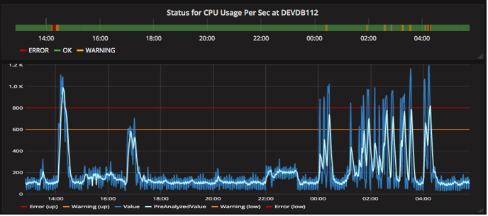
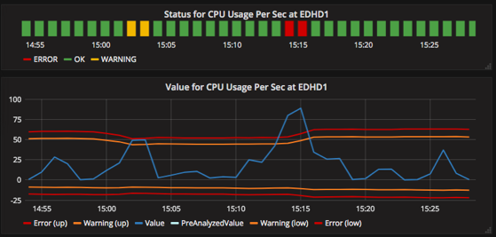
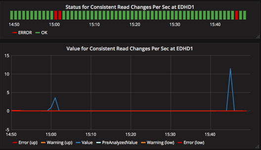
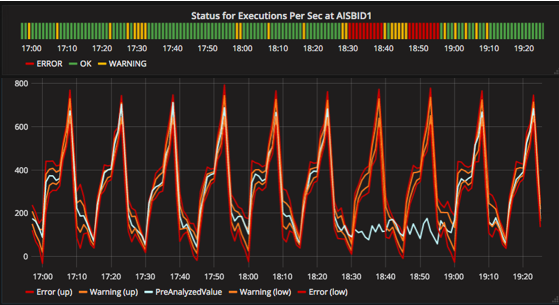

# Monitor: analysis

Analysis serve to determine the status of a metric, the status can be OK, WARNING, ERROR or EXCEPTION.

Each metric analysis works only with a type metric values.

## None analysis

Result of this analysis is always OK.

This is the default analysis of a monitor.

Configuration:
```
monitor.<monitor-id>.analysis.type = none
```

## Always true analysis

Filter metrics with boolean values. 

If incoming metric is true, analysis result is OK, otherwise ERROR.

Configuration:
```
monitor.<monitor-id>.analysis.type = true
```

## Fixed thresholds analysis

Filter metrics with float values. 

Fixed values determine the status of the metric. 
If metric goes upper or lower these values, corresponding status (warning or error) is produced. Otherwise, ok status is produced.

Configuration:
```
monitor.<monitor-id>.analysis.type = fixed-threshold
monitor.<monitor-id>.analysis.error.upperbound = <value>
monitor.<monitor-id>.analysis.warn.upperbound  = <value>
monitor.<monitor-id>.analysis.warn.lowerbound  = <value>
monitor.<monitor-id>.analysis.error.lowerbound = <value>
```

An example of the result of this analysis can be seen in the following image.


## Recent activity analysis 

Filter metrics with float values.

Error and warning thresholds are computed using average and variance from previous period. Period is indicated with "pareiod" parameter.

Optionally, a learning ratio can be configured with "learning.ratio" parameter. In that case "period" will be ignored and average and variance will be learnt by using this ratio.  

- Upper error threshold is computed as: mean + variance * error.ratio
- Upper warning threshold is computed as: mean + variance * warn.ratio
- Lower warning threshold is computed as: mean - variance * warn.ratio
- Lower error threshold is computed as: mean - variance * error.ratio

Metrics which value is greater than (mean + variance * learning.upperbound.ratio) or less than (mean + variance * learning.lowerbound.ratio) will not be learnt.

Configuration:
```
monitor.<monitor-id>.analysis.type = recent
monitor.<monitor-id>.analysis.period = <period like 1h, 3m or 45s> (default: 5m)
monitor.<monitor-id>.analysis.learning.ratio = <float> (dafault: not-set)
monitor.<monitor-id>.analysis.error.ratio = <float> (dafault: 1.8)
monitor.<monitor-id>.analysis.warn.ratio = <float> (dafault: 1.5)
monitor.<monitor-id>.analysis.learning.upperbound.ratio = <float> (dafault: not-set)
monitor.<monitor-id>.analysis.learning.lowerbound.ratio = <float> (dafault: not-set)
# Each threshold can be activated by:
monitor.<monitor-id>.analysis.error.upperbound = <true|false> (default: false)
monitor.<monitor-id>.analysis.warn.upperbound  = <true|false> (default: false)
monitor.<monitor-id>.analysis.warn.lowerbound  = <true|false> (default: false)
monitor.<monitor-id>.analysis.error.lowerbound = <true|false> (default: false)
```

An example of the result of this analysis can be seen in the following image.


## Percentile analysis

Filter metrics with float values.

Error and warning thresholds are computed using percentiles from previos period.

- Upper error threshold is computed as: percentile(error.percentile) + diff(percentile - median) * error.ratio
- Upper warning threshold is computed as: percentile(warn.percentile) + diff(percentile - median) * warn.ratio
- Lower warning threshold is computed as: percentile(100 - warn.percentile) - diff(percentile - median) * warn.ratio
- Lower error threshold is computed as: percentile(100 - error.percentile) - diff(percentile - median) * error.ratio

Configuration:
```
monitor.<monitor-id>.analysis.type = percentile
monitor.<monitor-id>.analysis.period = <period like 1h, 3m or 45s> (default: 5m)
monitor.<monitor-id>.analysis.error.percentile = <50-100> (dafault: 99)
monitor.<monitor-id>.analysis.error.ratio = <float> (dafault: 0.3)
monitor.<monitor-id>.analysis.warn.percentile = <50-100> (dafault: 98)
monitor.<monitor-id>.analysis.warn.ratio = <float> (dafault: 0.2)
# Each threshold can be activated by:
monitor.<monitor-id>.analysis.error.upperbound = <true|false> (default: false)
monitor.<monitor-id>.analysis.warn.upperbound  = <true|false> (default: false)
monitor.<monitor-id>.analysis.warn.lowerbound  = <true|false> (default: false)
monitor.<monitor-id>.analysis.error.lowerbound = <true|false> (default: false)
```

An example of the result of this analysis can be seen in the following image.


## Seasonal analysis

Filter metrics with float values.

Metric is supposed to behave similarly in every season. Saeson can be hour, day or week.

Using a learning coeficient, average and variance are computed along the season for every minute, these two values are used to calculate error and warning thresholds.

- Upper error threshold is computed as: mean + standDev * error.ratio
- Upper warning threshold is computed as: mean + standDev * warn.ratio
- Lower warning threshold is computed as: mean - standDev * warn.ratio
- Lower error threshold is computed as: mean - standDev * error.ratio

Configuration:
```
monitor.<monitor-id>.analysis.type = seasonal
monitor.<monitor-id>.analysis.season = <hour, day or week> (default: hour)
monitor.<monitor-id>.analysis.learning.ratio = <float> (default: 0.5)
monitor.<monitor-id>.analysis.error.ratio = <float> (default: 4)
monitor.<monitor-id>.analysis.warn.ratio = <float> (default: 2)
```  

An example of the result of this analysis can be seen in the following image.

