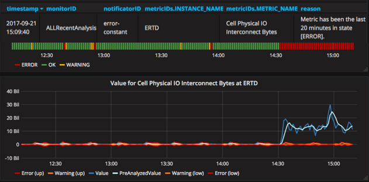
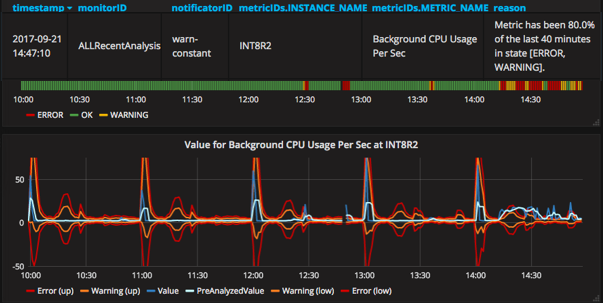

# Monitor: triggers

A trigger implements the logic to decide when to raise an action base on the status of the metric computed by the previous analysis.

All triggers have at least the following parameters:

```
monitor.<monitor-id>.triggers.<trigger-id>.type = <type> (default: statuses)
monitor.<monitor-id>.triggers.<trigger-id>.filter.attribute.<analyzed_metric_attribute_key> = <[!]regex_or_exact_value>
monitor.<monitor-id>.triggers.<trigger-id>.filter.attribute... (as many attributes as needed)
monitor.<monitor-id>.triggers.<trigger-id>.actuators = <actuators-ids> (default: none)
monitor.<monitor-id>.triggers.<trigger-id>.silent.period = <period like 1h, 3m or 45s> (default: 0)
monitor.<monitor-id>.triggers.<trigger-id>.silent.trigger.type = <type> (default: not set)
monitor.<monitor-id>.triggers.<trigger-id>.silent.trigger....
monitor.<monitor-id>.triggers.<trigger-id>.tags.<tag-key> = <value>
```

#### Silent period

Once an action is triggered, a period of no actions is applied that last "silent.period".

During this period you can optionally configure a "silent" trigger with "silent.trigger". 
This trigger acts during the silent period and could be used to raise actions when a previous problem has been resolved. 

When the "silent" trigger raises an action, silent period terminates (earlier than configured at silent.period). 

## Statuses trigger

If a metric arrives in any of the configured statuses, it triggers an action.

Possible statuses are: error, warning, ok, exception.

Configuration:
```
monitor.<monitor-id>.triggers.<trigger-id>.type = statuses
monitor.<monitor-id>.triggers.<trigger-id>.statuses = <concerned statuses separated by space>
```

Minimum period between two actions is ".silent.period".

## Constant status trigger

If a metric has been in configured statuses during the configured period (and maximum times if configured), it triggers an action.

Possible statuses are: error, warning, ok, exception.

Configuration:
```
monitor.<monitor-id>.triggers.<trigger-id>.type = constant
monitor.<monitor-id>.triggers.<trigger-id>.statuses = <concerned statuses separated by space>
monitor.<monitor-id>.triggers.<trigger-id>.period = <period like 1h, 3m or 45s> (default: 15m)
monitor.<monitor-id>.triggers.<trigger-id>.max-times = <consicutive times>
```

Minimum period between two actions is ".period" plus ".silent.period".

An example of the result of this trigger can be seen in the following image.


## Percentage status trigger

If a metric has been in configured statuses during a percentage of the configured period, it triggers an action.

Possible statuses are: error, warning, ok, exception.

Configuration:
```
monitor.<monitor-id>.triggers.<trigger-id>.type = percentage
monitor.<monitor-id>.triggers.<trigger-id>.statuses = <concerned statuses separated by space>
monitor.<monitor-id>.triggers.<trigger-id>.period = <period like 1h, 3m or 45s> (default: 15m)
monitor.<monitor-id>.triggers.<trigger-id>.percentage = <0-100> (default: 90)
```

Minimum period between two actions is ".period" plus ".silent.period".

An example of the result of this trigger can be seen in the following image.
